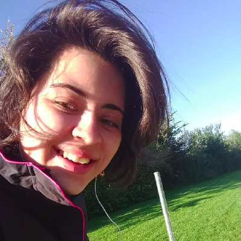

## About Me

Hi! My name is Bruna I am Brazilian and I have a bachelor degree in Computer Engineering from Federal University of Sao Carlos.

I am currently working as a Software Engineer @ Amazon computer. But I am also passionate and continuously learning about Data Science and Bioinformatics. Still, I am really looking forward to learning more about Computer Networks and Natural Computing.

In my spare time, you can find me reading a good book, riding my bicycle, enjoying a cup of coffee or (hopefully!) traveling.

### Find me:

[ **LinkedIn**](https://www.linkedin.com/in/bruna-zamith/) 

[ **Github**](https://github.com/bzamith) 

[**GoodReads**](https://www.goodreads.com/user/show/93100732-bruna-zamith)

## Studies & Concepts

- [**Studies**](studies): Topics that I am currently studying or plan to study.
- [**My SDE Interview Studies**](https://github.com/bzamith/MySDEInterviewStudies): Coding Interview Questions solved by me while studying for SDE Interview. And a pdf with the topics I've studied while preparing for the interview.
- [**Data Science Concepts**](DSconcepts): A compilation of Q&A related to Data Science topics.
- [**Software Engineering Concepts**](SEconcepts): A compilation of Q&A related to Software Engineering topics and others.
- [**AWS Concepts**](AWSconcepts): A compilation of Q&A related to Amazon Web Services topics.

## Publications

1. [*Strategies for Selection of Positive and Negative Instances in the Hierarchical Classification of Transposable Elements*](https://ieeexplore.ieee.org/document/8575650) - Zamith B., Pereira, T. G., Nakano, K. F., Cerri R. (2018). Brazilian Conference on Intelligent Systems (BRACIS).
2. [*A Genetic Algorithm for Transposable Elements Hierarchical Classification Rule Induction*](https://ieeexplore.ieee.org/document/8477642) - Pereira, T. G., Zamith B., Cerri R. (2018). IEEE Congress on Evolutionary Computation (IEEE CEC).
3. [*A New Machine Learning Dataset for Hierarchical Classification of Transposable Elements*](https://www.cin.ufpe.br/~rbcp/bracis-papers/ENIAC/Sessao%20de%20Posters/A%20New%20Machine%20Learning%20Dataset%20for%20Hierarchical%20Classification%20of%20Transposable%20Elements.pdf) - Zamith B., Cerri R. (2016). National Meeting of Artificial and Computational Intelligence (ENIAC).
4. [*Decisions Trees for Hierarchical Classification of Transposable Elements*](https://www.kuleuven-kulak.be/benelearn/papers/Benelearn_2016_paper_57.pdf) - Zamith B., Gomes Mantovani R., Schietgat L., Vens C., Cerri R. (2016). Proceedings of the 25th Belgian-Dutch Machine Learning Conference (Benelearn).
